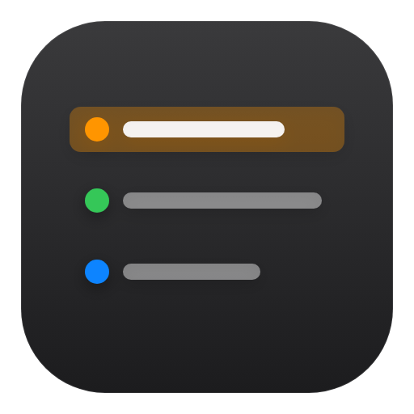
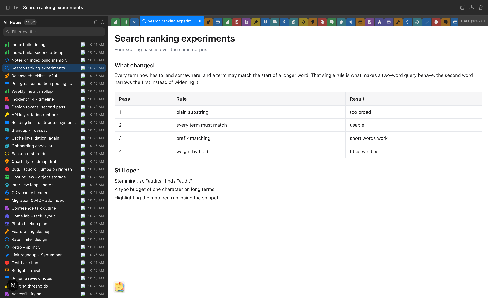
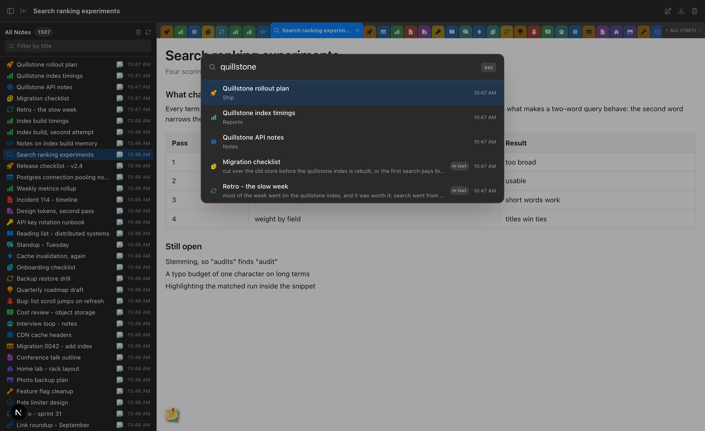
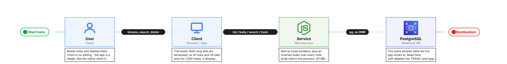
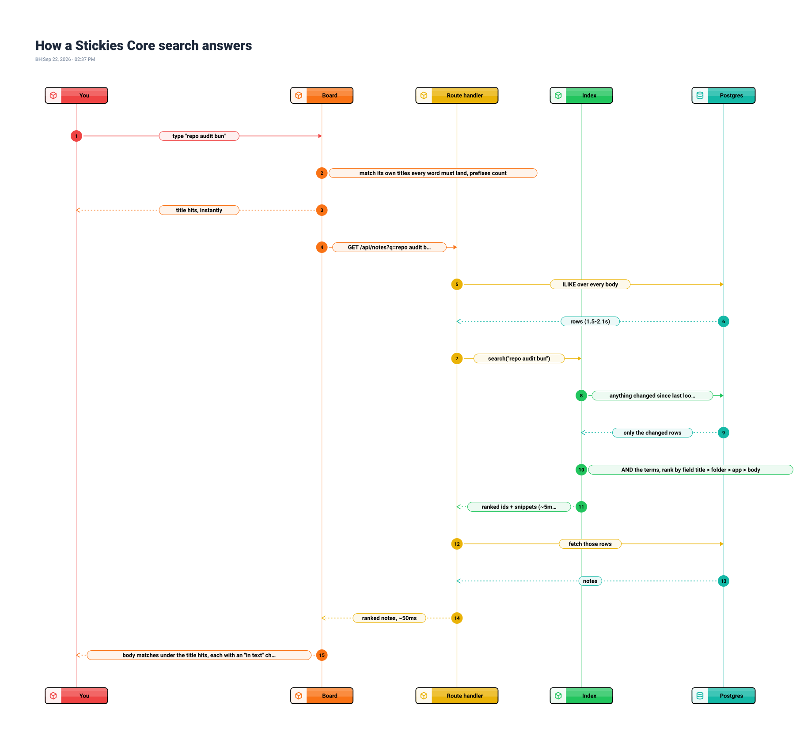

<div align="center">

#  Stickies Core

**The reading half of [Stickies](https://github.com/bunlongheng/stickies), in 3,600 lines.**

One flat list of every note, ranked search over every word in every body, and a soft delete. No editing, no folders, no sync.




<sub>Screenshots use demo data.</sub>

</div>

## Read this before you clone

**This is a client, not an app that stands alone.** It reads a `stickies` table
that something else created - normally [Stickies](https://github.com/bunlongheng/stickies).
Point it at that database, or at a copy of it.

| You provide | Why |
|---|---|
| **PostgreSQL with a `stickies` table** | Every note lives there. There is no migration step and no bundled database |
| **`OWNER_USER_ID`** | The one account whose notes the board shows |
| **localhost** | There is no sign-in. Anyone who can open the page has that account's notes |

**There is no authentication.** That is deliberate for a local reader, and it is
why putting this on a public address publishes the database behind it. See
[SECURITY.md](SECURITY.md).

**Nothing is destroyed.** Deleting sets `trashed_at`; emptying TRASH for real is
off unless you opt in with `STICKIES_CORE_ALLOW_PURGE=1`.

## Why it exists

The full app is 17,179 lines, and 7,690 of them are one file with 139 `useState`
calls in it. This is the same board rewritten around the three things a note app
is actually used for, to see what that costs.

| | stickies | stickies-core |
|---|---|---|
| Source lines (`app` + `components` + `lib`) | 17,180 | **3,615** |
| Runtime dependencies | 30 | **7** |
| Largest file | 7,690 lines | **364** |
| `useState` in one file | 139 | 13 |

## Features

- **One flat list of every note** - no folders to walk, windowed so 1,400 notes cost 41 rows of DOM
- **Ranked search over every body**, answering in about 50 milliseconds
- **A tab strip** that mirrors the list, and arrow keys that walk it
- **Find in note** (`Cmd+F`), page zoom that is remembered, save the whole note as PNG or WebP
- **Share a note** with anyone holding the link, and **lock it behind a passcode**
- **TRASH** with restore, undo, and a countdown to the 7-day purge
- **A composer** for a plain-text note, filed and iconed on the way in
- A dissolve, with a synthesised whoosh, when a note goes

## Quick start

```bash
git clone https://github.com/bunlongheng/stickies-core.git
cd stickies-core
npm install
cp .env.example .env.local     # DATABASE_URL + OWNER_USER_ID
npm run dev                    # http://localhost:4445
```

If the board is empty, `OWNER_USER_ID` does not match any row. If every request
fails, `DATABASE_URL` is wrong - the pool throws on its first query, not at boot.

## Search

Every word has to land somewhere, and a word may match the start of a longer one.
That is what makes **`repo audit bun`** return Bunlong's repo audits and nothing
else: `repo` and `audit` match the `repo-audit` folder, `bun` matches the start of
`bunlongheng`. Titles outrank folders, folders outrank the posting app, and all
three outrank the body. A word nobody knows is cut into two that are known, so
`repoaudit` still finds notes filed under `repo-audit`.



`content ILIKE '%x%'` is a sequential scan over 141 MB of note bodies and measured
**1.5-2.1s** a query. Postgres would do better with a trigram index on `content`,
but that is a schema change to the database the real app shares - so the index
lives in this process instead.

| query | hits | time |
|---|---|---|
| `repo audit bun` | 50 | **51ms** |
| `repoaudit bun` | 50 | **50ms** |
| `session recap stickies` | 31 | **109ms** |
| `hue bridge flash` | 4 | **44ms** |

The bodies are stripped of markup in Postgres, which is what makes the build
affordable: 141 MB of HTML comes back as 10 MB of words, 28,051 terms, in 4.7s.
Every search first pulls whatever changed since it last looked - one indexed range
scan, throttled to once a second - so a note written straight into Postgres is
searchable by its body about a second later, and one trashed there disappears just
as fast.

## Architecture

A Next.js App Router app talking to Postgres through `pg`, with the search index
held in the server process.

<a href="https://flows-bheng.vercel.app/?id=77f0c76c-4428-46d6-b12a-9b5bbc8cf138">
  
</a>

<sub>Diagram made with [Flows](https://flows-bheng.vercel.app).</sub>

## How a search answers

<a href="https://sequences-bheng.vercel.app/d/abbded15-d190-4f50-92a1-d40db5607e08">
  
</a>

Title matches paint instantly from the list already in the browser. The ranked
pass over every body lands behind them, and is served from the database rather
than blocked on the index while that is still building.

<sub>Made with [Sequences](https://sequences-bheng.vercel.app).</sub>

## Structure

```
app/
  page.tsx                 server-renders the first list, hands it to the client
  api/notes/               GET list | GET ?q= ranked search | POST create
  api/notes/[id]/          GET body | PATCH trash | PATCH restore
  api/trash/               GET trash | DELETE purge
components/
  Board.tsx                the shell: shortcuts, dissolve, overlays
  Toolbar.tsx              one bar across the window, as macOS does it
  Sidebar.tsx              header, filter, density, resize, windowed list
  TabBar.tsx  Detail.tsx  FindBar.tsx  SearchPalette.tsx  Composer.tsx
lib/
  use-board.ts             all list state in one hook
  search-index.ts          the inverted index over every body
  query.ts                 one matcher, shared by the sidebar and the server
  notes.ts  db.ts  format.ts  icons.tsx  find.ts  dust.ts  whoosh.ts
```

Both long lists are windowed, because each mirrors all 1,400 notes. With every
row in the DOM, one write froze the window for 22 seconds.

## Tests

```bash
npm test                   # 84 acceptance checks against a running dev server
```

It drives the real app against the real database, seeds its own fixtures, and
deletes exactly those at the end. See [CONTRIBUTING.md](CONTRIBUTING.md).

## Tech stack

Next.js 16 · React 19 · TypeScript · PostgreSQL (`pg`, no ORM) · Tailwind 4 · Heroicons · Playwright

## Contributing

See [CONTRIBUTING.md](CONTRIBUTING.md). Security issues go through [SECURITY.md](SECURITY.md), never a public issue.

## License

[MIT](LICENSE) (c) Bunlong Heng

---

<div align="center">

<a href="https://bunlongheng.com"></a>
<a href="https://www.linkedin.com/in/bunlongheng/"></a>
<a href="https://www.instagram.com/ibunlong/"></a>
<a href="mailto:bheng.code@gmail.com"></a>

<br>

Built by **[Bunlong](https://bunlongheng.com)** &nbsp;·&nbsp; [more apps](https://bunlongheng.com/projects)

</div>
